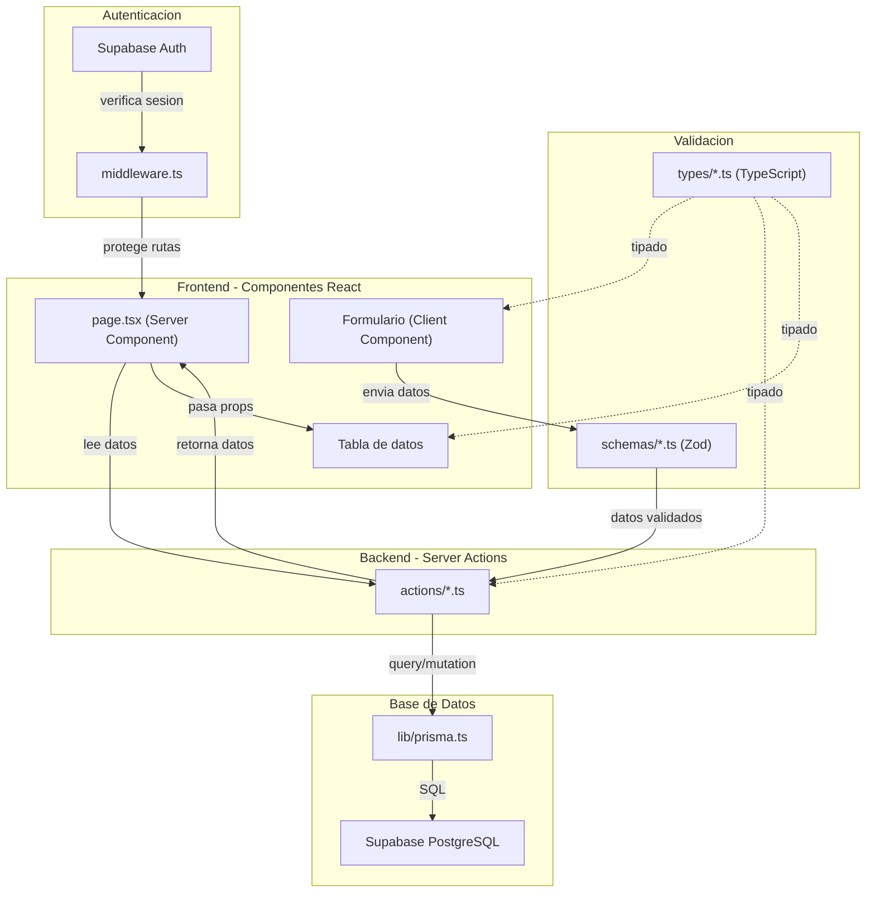

# Plan Completo - Drugstore Manager SaaS MVP

## Estado Actual del Proyecto

Tu proyecto ya tiene configurado:

- Next.js 16.1.6 con App Router y PPR incremental
- React 19, TypeScript estricto, Tailwind CSS v4
- shadcn/ui (estilo "new-york") con Lucide icons
- pnpm como package manager
- Alias `@/*` configurado en tsconfig

**Falta**: Prisma, Supabase, Zod, React Hook Form, Recharts, y toda la estructura de carpetas del negocio.

---

## Respuesta: Server Actions vs API Endpoints

**Recomendacion: Server Actions** para tu V1. Razones:

- **No tenes consumidores externos** (no hay app mobile en V1) -- Server Actions son perfectas cuando todo se consume desde el mismo frontend Next.js
- **Type-safety de punta a punta** -- TypeScript valida los datos desde el formulario hasta la base de datos sin capas intermedias
- **Menos boilerplate** -- No necesitas crear archivos `route.ts` con `GET`, `POST`, etc. Una funcion con `"use server"` y listo
- **Mejor integracion con React** -- `useActionState`, `useFormStatus`, revalidacion automatica del cache
- **Mas simple de mantener** -- Un solo archivo `actions/products.ts` en vez de `app/api/products/route.ts` + `app/api/products/[id]/route.ts`

```typescript
// Ejemplo: Server Action vs API Route

// --- SERVER ACTION (lo que vamos a usar) ---
// actions/products.ts
"use server";
export async function crearProducto(data: ProductoFormData) {
  const validado = productoSchema.parse(data);
  return await prisma.producto.create({ data: validado });
}

// --- API ROUTE (NO usamos esto en V1) ---
// app/api/products/route.ts
export async function POST(req: Request) {
  const body = await req.json();
  const validado = productoSchema.parse(body);
  return Response.json(await prisma.producto.create({ data: validado }));
}
```

**Cuando agregarias API Routes?** Solo si en V2+ necesitas una app mobile o integracion externa que consuma datos.

---

## Respuesta: Categoria en la BD

**Si, mantenela.** Razones:

- Permite filtrar productos en la tabla (ej: "mostrame solo Medicamentos")
- Habilita insights en el dashboard (ej: "Categoria mas vendida del mes")
- Simple de implementar: un campo `String` en el modelo, no necesitas tabla separada en V1

---

## TypeScript Types -- Que son y como funcionan en tu proyecto

### Que son los Types?

Los **types** en TypeScript son contratos que definen la forma exacta de tus datos. Funcionan como un "molde" que le dice al codigo que propiedades tiene un objeto, que tipo de valor tiene cada una, y cuales son obligatorias u opcionales.

### Como influyen en tu proyecto?

```
         TYPES (contratos de datos)
              |
    +---------+---------+
    |         |         |
 Prisma    Schemas    Components
 (BD)      (Zod)      (React)
```

Los types actuan como **fuente de verdad unica**. Cuando definis que un `Producto` tiene `precio_venta: number`, eso se respeta en:

1. **La base de datos** (Prisma genera types automaticamente desde el schema)
2. **La validacion** (Zod verifica que los datos del formulario cumplan el type)
3. **Los componentes** (React sabe exactamente que props espera cada componente)
4. **Las Server Actions** (TypeScript valida que recibis y devolves los tipos correctos)

### Ejemplo concreto en tu proyecto

```typescript
// types/product.ts -- Tipo base del producto
export type Producto = {
  id: string;
  tienda_id: string;
  nombre: string;
  categoria: string;
  stock: number;
  stock_minimo: number;
  precio_compra: number;
  precio_venta: number;
  fecha_vencimiento: Date | null;
  created_at: Date;
};

// Tipo para el formulario (no incluye id ni timestamps)
export type ProductoFormData = Omit<
  Producto,
  "id" | "tienda_id" | "created_at"
>;

// Tipo para la tabla (incluye campo calculado)
export type ProductoConMargen = Producto & {
  margen: number; // precio_venta - precio_compra
};
```

### Utilidades de TypeScript que vas a usar

- `**type**` -- Define la forma de un objeto
- `**Omit<T, K>**` -- Crea un type sin ciertas propiedades (ej: formulario sin `id`)
- `**Pick<T, K>**` -- Crea un type solo con ciertas propiedades
- `**Partial<T>**` -- Hace todas las propiedades opcionales (util para edicion)
- `**&` (interseccion) -- Combina types (ej: producto + campos calculados)
- `**enum` -- Define valores fijos (ej: `Rol.OWNER | Rol.EMPLOYEE`)

### Donde viven los types en tu proyecto

```
types/
├── index.ts      -- Re-exporta todo (barrel file)
├── product.ts    -- Producto, ProductoFormData, ProductoConMargen
├── sale.ts       -- Venta, VentaFormData, VentaConProducto
├── supplier.ts   -- Proveedor, ProveedorFormData
├── store.ts      -- Tienda
└── user.ts       -- Usuario, Rol
```

Se importan asi: `import type { Producto } from "@/types"`

---

## Estructura de Carpetas Definitiva

```
drugstore-manager/
│
├── prisma/
│   ├── schema.prisma              # Modelos de BD (Prisma)
│   └── seed.ts                    # Datos de prueba
│
├── app/
│   ├── layout.tsx                 # Layout raiz (fuentes, providers)
│   ├── globals.css                # Tailwind + shadcn theme
│   │
│   ├── (auth)/                    # Grupo: paginas publicas
│   │   ├── layout.tsx             # Layout sin sidebar
│   │   ├── login/
│   │   │   └── page.tsx
│   │   └── register/
│   │       └── page.tsx
│   │
│   └── (dashboard)/               # Grupo: paginas protegidas
│       ├── layout.tsx             # Layout con sidebar + header
│       ├── page.tsx               # Dashboard principal
│       ├── productos/
│       │   ├── page.tsx           # Lista de productos
│       │   ├── nuevo/
│       │   │   └── page.tsx       # Crear producto
│       │   └── [id]/
│       │       └── page.tsx       # Editar producto
│       ├── ventas/
│       │   ├── page.tsx           # Historial de ventas
│       │   └── nueva/
│       │       └── page.tsx       # Registrar venta
│       ├── proveedores/
│       │   ├── page.tsx           # Lista proveedores
│       │   ├── nuevo/
│       │   │   └── page.tsx       # Crear proveedor
│       │   └── [id]/
│       │       └── page.tsx       # Editar proveedor
│       └── alertas/
│           └── page.tsx           # Alertas inteligentes
│
├── components/
│   ├── ui/                        # shadcn/ui (se generan con CLI)
│   │   ├── button.tsx
│   │   ├── input.tsx
│   │   ├── table.tsx
│   │   ├── card.tsx
│   │   ├── dialog.tsx
│   │   ├── form.tsx
│   │   └── ...
│   ├── layout/                    # Componentes de estructura
│   │   ├── sidebar.tsx
│   │   ├── header.tsx
│   │   └── mobile-nav.tsx
│   ├── dashboard/                 # Componentes del dashboard
│   │   ├── stats-cards.tsx
│   │   ├── sales-chart.tsx
│   │   └── low-stock-table.tsx
│   ├── products/                  # Componentes de productos
│   │   ├── product-form.tsx
│   │   ├── product-table.tsx
│   │   └── columns.tsx
│   ├── sales/                     # Componentes de ventas
│   │   ├── sale-form.tsx
│   │   └── sale-table.tsx
│   ├── suppliers/                 # Componentes de proveedores
│   │   ├── supplier-form.tsx
│   │   └── supplier-table.tsx
│   └── alerts/                    # Componentes de alertas
│       └── alert-list.tsx
│
├── actions/                       # Server Actions
│   ├── auth.ts                    # Login, registro, logout
│   ├── products.ts                # CRUD productos
│   ├── sales.ts                   # Registrar/listar ventas
│   ├── suppliers.ts               # CRUD proveedores
│   └── dashboard.ts               # Queries del dashboard
│
├── types/                         # TypeScript types
│   ├── index.ts                   # Barrel export
│   ├── product.ts
│   ├── sale.ts
│   ├── supplier.ts
│   ├── store.ts
│   └── user.ts
│
├── schemas/                       # Validaciones Zod
│   ├── product.ts
│   ├── sale.ts
│   ├── supplier.ts
│   └── auth.ts
│
├── lib/                           # Utilidades y clientes
│   ├── utils.ts                   # cn() ya existente
│   ├── prisma.ts                  # Singleton Prisma Client
│   └── supabase/
│       ├── client.ts              # Supabase browser client
│       └── server.ts              # Supabase server client
│
├── hooks/                         # Custom React Hooks
│   └── use-debounce.ts
│
├── middleware.ts                   # Proteccion de rutas (auth)
│
├── .env.local                     # Variables de entorno
├── components.json                # Config shadcn (ya existe)
├── next.config.ts                 # Config Next.js (ya existe)
├── package.json
├── tsconfig.json
└── pnpm-lock.yaml
```

### Flujo de datos en la app



---

## Fases del Roadmap

### FASE 1 -- Fundacion (Semana 1-2)

**Objetivo**: Proyecto configurado, BD conectada, auth funcionando.

**Dependencias a instalar manualmente**:

```bash
pnpm add prisma @prisma/client --save-dev
pnpm add @supabase/supabase-js @supabase/ssr
pnpm add zod react-hook-form @hookform/resolvers
```

**Tareas**:

1. Crear proyecto en Supabase (dashboard.supabase.com)
2. Crear archivo `.env.local` con las keys de Supabase y DATABASE_URL
3. Inicializar Prisma: `npx prisma init`
4. Escribir `prisma/schema.prisma` con los 5 modelos (Users, Stores, Products, Sales, Suppliers)
5. Ejecutar migracion: `npx prisma migrate dev --name init`
6. Crear `lib/prisma.ts` (singleton del cliente)
7. Crear `lib/supabase/client.ts` y `lib/supabase/server.ts`
8. Crear `middleware.ts` para proteger rutas
9. Crear `types/` con todos los types base
10. Crear layouts: `(auth)/layout.tsx` y `(dashboard)/layout.tsx`
11. Crear paginas de login y registro con Supabase Auth
12. Crear `actions/auth.ts` con login, registro, logout

**Resultado**: Un usuario puede registrarse, loguearse, y tiene una tienda asociada.

---

### FASE 2 -- Productos (Semana 3)

**Dependencias**: Ninguna nueva (Zod y RHF ya instalados en Fase 1).

**Componentes shadcn a agregar**:

```bash
npx shadcn@latest add button input table card form dialog label select badge
```

**Tareas**:

1. Crear `schemas/product.ts` (validacion Zod)
2. Crear `types/product.ts` (types del producto)
3. Crear `actions/products.ts` (CRUD completo)
4. Crear `components/products/product-form.tsx`
5. Crear `components/products/product-table.tsx` + `columns.tsx`
6. Crear paginas: `productos/page.tsx`, `productos/nuevo/page.tsx`, `productos/[id]/page.tsx`
7. Agregar indicador visual de stock bajo (badge rojo cuando stock < stock_minimo)
8. Crear `components/layout/sidebar.tsx` y `header.tsx`

**Resultado**: CRUD completo de productos con validacion, tabla y alertas de stock bajo.

---

### FASE 3 -- Ventas (Semana 4)

**Tareas**:

1. Crear `schemas/sale.ts` y `types/sale.ts`
2. Crear `actions/sales.ts` (registrar venta + descontar stock en una transaccion)
3. Crear `components/sales/sale-form.tsx` (seleccionar producto, cantidad, calculo automatico)
4. Crear `components/sales/sale-table.tsx`
5. Crear paginas: `ventas/page.tsx`, `ventas/nueva/page.tsx`
6. Logica clave: al registrar venta, guardar `precio_compra_unitario` y `precio_venta_unitario` del momento

**Logica critica de la venta**:

```typescript
// actions/sales.ts - Transaccion atomica
await prisma.$transaction(async (tx) => {
  const producto = await tx.producto.findUniqueOrThrow({ where: { id } });
  if (producto.stock < cantidad) throw new Error("Stock insuficiente");

  await tx.venta.create({
    data: {
      producto_id: id,
      cantidad,
      precio_venta_unitario: producto.precio_venta,
      precio_compra_unitario: producto.precio_compra,
      margen_unitario: producto.precio_venta - producto.precio_compra,
      total_venta: producto.precio_venta * cantidad,
      total_margen: (producto.precio_venta - producto.precio_compra) * cantidad,
    },
  });

  await tx.producto.update({
    where: { id },
    data: { stock: { decrement: cantidad } },
  });
});
```

**Resultado**: Sistema funcional -- se pueden registrar ventas y el stock se actualiza.

---

### FASE 4 -- Dashboard Inteligente (Semana 5)

**Dependencias a instalar**:

```bash
pnpm add recharts
```

**Componentes shadcn**:

```bash
npx shadcn@latest add chart
```

**Tareas**:

1. Crear `actions/dashboard.ts` (queries por rango de fechas)
2. Crear `components/dashboard/stats-cards.tsx` (6 tarjetas: ayer + mes)
3. Crear `components/dashboard/sales-chart.tsx` (grafico ventas diarias del mes)
4. Crear `components/dashboard/low-stock-table.tsx` (productos bajo stock)
5. Armar `(dashboard)/page.tsx` integrando todo

**Metricas del dashboard**:

- Productos vendidos ayer / mes
- Ingresos ayer / mes
- Ganancia ayer / mes
- Grafico de ventas por dia del mes actual
- Tabla de productos con stock bajo

**Resultado**: Dashboard con datos reales que muestra la salud del negocio.

---

### FASE 5 -- Alertas Inteligentes (Semana 6)

**Tareas**:

1. Crear logica de alertas en `actions/dashboard.ts` o `actions/alerts.ts`
2. Crear `components/alerts/alert-list.tsx`
3. Crear pagina `alertas/page.tsx`
4. Agregar badge de notificacion en el sidebar/header

**Reglas de alertas** (logica simple, no IA):

- `stock < stock_minimo` --> "Stock bajo"
- `fecha_vencimiento < hoy + 7 dias` --> "Proximo a vencer"
- Producto sin ventas en 30 dias --> "Sin movimiento"

**Resultado**: El duenio ve alertas accionables sin tener que revisar producto por producto.

---

### FASE 6 -- Proveedores (Semana 7)

**Tareas**:

1. Crear `schemas/supplier.ts` y `types/supplier.ts`
2. Crear `actions/suppliers.ts` (CRUD)
3. Crear `components/suppliers/supplier-form.tsx` y `supplier-table.tsx`
4. Crear paginas: `proveedores/page.tsx`, `proveedores/nuevo/page.tsx`, `proveedores/[id]/page.tsx`
5. (Opcional) Asociar proveedor a producto en el modelo

**Resultado**: MVP completo listo para validar con clientes en Tucuman.

---

## Schema Prisma (Vista previa)

```prisma
generator client {
  provider = "prisma-client-js"
}

datasource db {
  provider = "postgresql"
  url      = env("DATABASE_URL")
}

enum Rol {
  OWNER
  EMPLOYEE
}

model Usuario {
  id         String   @id @default(uuid())
  email      String   @unique
  nombre     String
  rol        Rol      @default(EMPLOYEE)
  tienda_id  String
  tienda     Tienda   @relation(fields: [tienda_id], references: [id])
  created_at DateTime @default(now())

  @@map("usuarios")
}

model Tienda {
  id           String       @id @default(uuid())
  nombre       String
  usuarios     Usuario[]
  productos    Producto[]
  ventas       Venta[]
  proveedores  Proveedor[]
  created_at   DateTime     @default(now())

  @@map("tiendas")
}

model Producto {
  id                 String    @id @default(uuid())
  tienda_id          String
  tienda             Tienda    @relation(fields: [tienda_id], references: [id])
  nombre             String
  categoria          String
  stock              Int       @default(0)
  stock_minimo       Int       @default(5)
  precio_compra      Float
  precio_venta       Float
  fecha_vencimiento  DateTime?
  ventas             Venta[]
  created_at         DateTime  @default(now())

  @@map("productos")
}

model Venta {
  id                      String   @id @default(uuid())
  tienda_id               String
  tienda                  Tienda   @relation(fields: [tienda_id], references: [id])
  producto_id             String
  producto                Producto @relation(fields: [producto_id], references: [id])
  cantidad                Int
  precio_venta_unitario   Float
  precio_compra_unitario  Float
  margen_unitario         Float
  total_venta             Float
  total_margen            Float
  created_at              DateTime @default(now())

  @@map("ventas")
}

model Proveedor {
  id         String   @id @default(uuid())
  tienda_id  String
  tienda     Tienda   @relation(fields: [tienda_id], references: [id])
  nombre     String
  telefono   String?
  dia_visita String?
  created_at DateTime @default(now())

  @@map("proveedores")
}
```

---

## Resumen de Dependencias a Instalar (Manual)

**Fase 1**:

```bash
pnpm add @supabase/supabase-js @supabase/ssr zod react-hook-form @hookform/resolvers
pnpm add -D prisma
pnpm add @prisma/client
```

**Fase 4**:

```bash
pnpm add recharts
```

No se necesitan mas dependencias. El stack es liviano a proposito.
